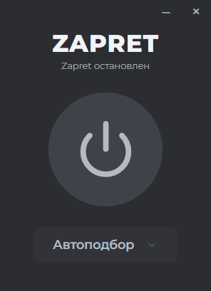

# Zapret-GUI




Удобный графический интерфейс для управления [утилитой zapret от flowseal](https://github.com/flowseal/zapret-discord-youtube). GUI берет на себя запуск службы и работу с конфигурациями, избавляя от необходимости использовать терминал.

## Стек технологий
- **Backend:** Rust / Tauri v2
- **Frontend:** React

## Основные функции
- **Управление одной кнопкой:** Быстрый запуск и остановка службы.
- **Выбор стратегий:** Удобный выпадающий список с готовыми конфигурациями.
- **Автоподбор:** Автоматическое тестирование параметров для поиска рабочего решения.
- **Эффективность:** Минимальное потребление системных ресурсов благодаря Rust.  

## Сборка и запуск

### Требования
- [Rust](https://www.rust-lang.org/tools/install)
- [Node.js](https://nodejs.org/)
- [pnpm](https://pnpm.io/installation)

### Инструкция
1. Клонируйте репозиторий:
   ```bash
   git clone https://github.com/elev1e1nSure/zapret-gui.git
   cd zapret-gui
   ```
2. Установите зависимости:
   ```bash
   pnpm install
   ```
3. Запустите в режиме разработки:
   ```bash
   pnpm tauri dev
   ```
4. Соберите финальный бинарный файл:
   ```bash
   pnpm tauri build
   ```
Готовый билд будет находиться в директории `src-tauri/target/release/bundle`.
